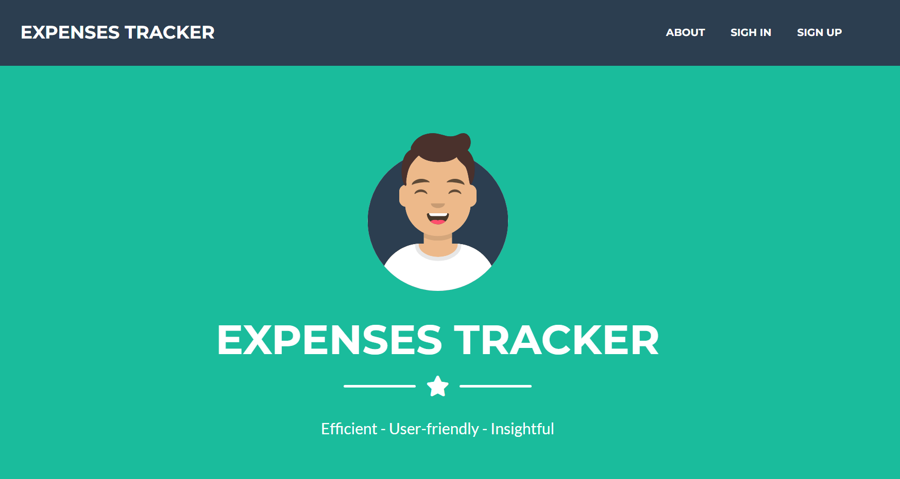
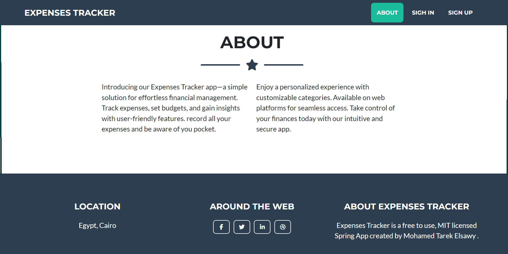
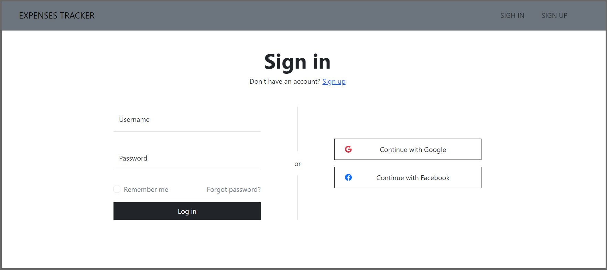
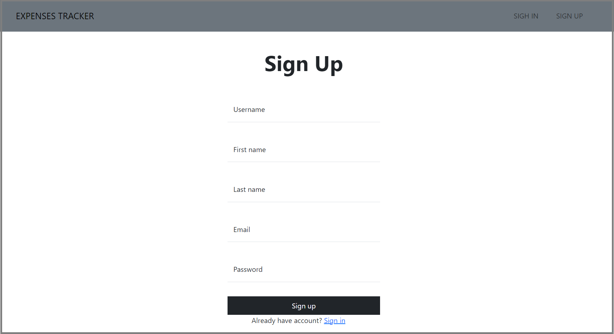
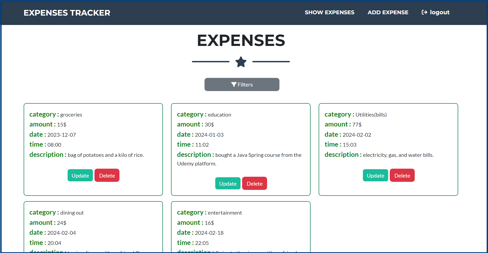
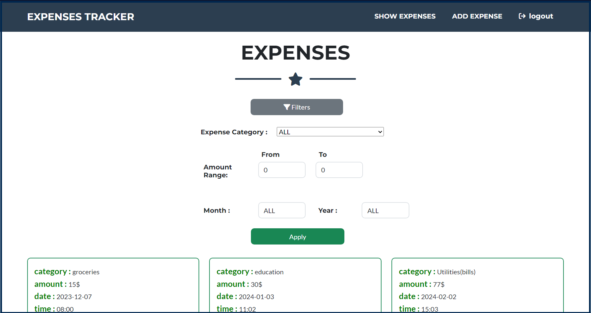
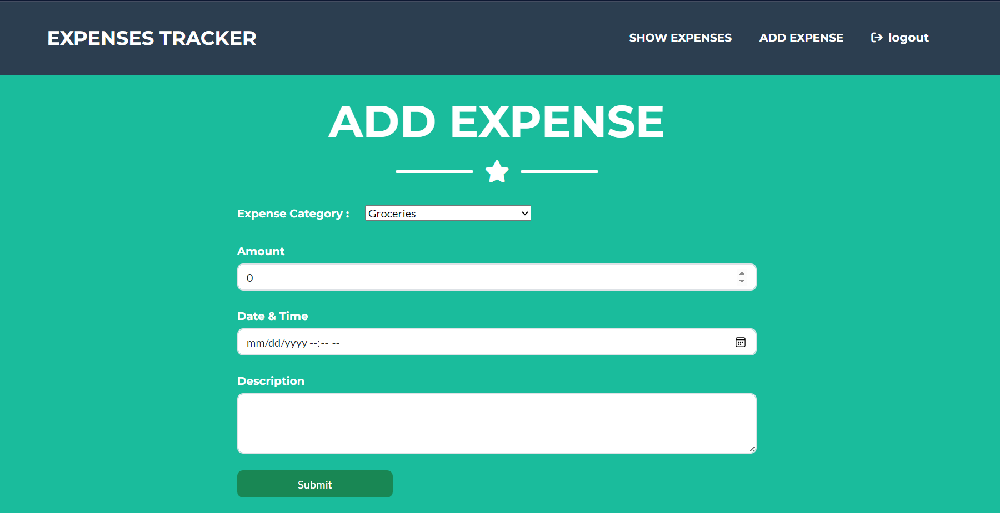
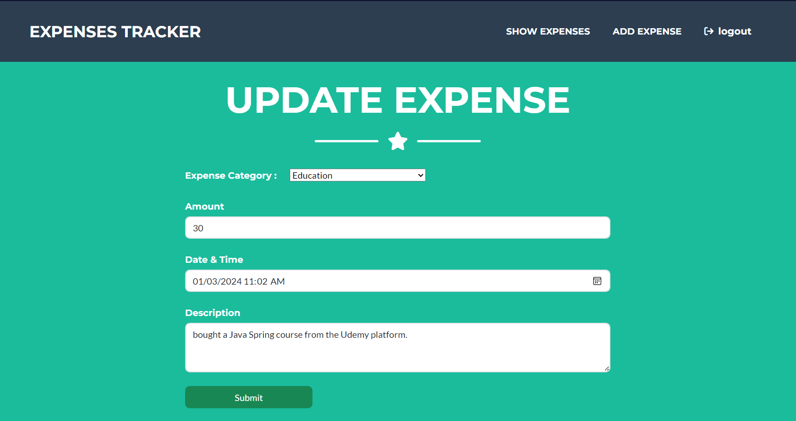

# Expense Tracker Web Application

A production-style containerized Expense Tracker application built using **Spring Boot**, **MySQL**, **Docker**, **Docker Compose**, and **Nginx Reverse Proxy**.

This project demonstrates end-to-end application containerization, multi-container orchestration, persistent storage management, and reverse proxy configuration using modern DevOps practices.

---

## Features

* User expense management system
* Spring Boot backend application
* MySQL database integration
* Containerized using Docker
* Multi-container orchestration using Docker Compose
* Nginx reverse proxy setup
* Persistent MySQL storage using Docker Volumes
* Health checks for database service
* Production-style network isolation using custom Docker networks

---

## Tech Stack

### Backend

* Java 17
* Spring Boot
* Spring Data JPA
* Hibernate
* Maven

### Database

* MySQL 8

### DevOps & Infrastructure

* Docker
* Docker Compose
* Nginx Reverse Proxy
* Docker Networking
* Docker Volumes
* Multi-stage Docker Builds

---

## Project Architecture

```text
                        ┌─────────────┐
                        │   Browser   │
                        └──────┬──────┘
                               │
                               ▼
                     ┌─────────────────┐
                     │      Nginx      │
                     │ Reverse Proxy   │
                     └────────┬────────┘
                              │
                              ▼
                  ┌─────────────────────┐
                  │ Spring Boot Backend │
                  │     Expense App     │
                  └─────────┬───────────┘
                            │
                            ▼
                    ┌────────────────┐
                    │     MySQL      │
                    │ Persistent DB  │
                    └────────────────┘
```

---

## Docker Architecture

The application runs as three separate containers:

| Container  | Purpose                           |
| ---------- | --------------------------------- |
| mysql      | Stores application data           |
| expenseapp | Spring Boot application           |
| nginx_cont | Reverse proxy and request routing |

All containers communicate through a dedicated Docker bridge network.

---

## Project Structure

```text
Expenses-Tracker-WebApp/
│
├── Dockerfile
├── docker-compose.yml
├── pom.xml
├── sql_script.sql
├── README.md
│
├── src/
│
├── nginx/
│   ├── Dockerfile
│   └── nginx.conf
│
├── screenshots/
│
└── target/
```

---

## Multi Stage Docker Build

The application uses a multi-stage Docker build:

### Builder Stage

* Maven image compiles the application
* Generates executable JAR file

### Runtime Stage

* Lightweight Eclipse Temurin JRE image
* Runs only the compiled application
* Reduces final image size significantly

---

## Docker Images Used

* `eclipse-temurin:21-jre-alpine`
* `mysql:latest`
* `nginx:latest`

---

## Running the Project

### Clone repository

```bash
git clone https://github.com/shamelsk/Expenses-Tracker-WebApp.git
cd Expenses-Tracker-WebApp
```

### Start application

```bash
docker compose up --build
```

### Run in detached mode

```bash
docker compose up -d --build
```

### Stop containers

```bash
docker compose down
```

### Remove containers and volumes

```bash
docker compose down -v
```

---

## Application Access

| Service                 | URL                   |
| ----------------------- | --------------------- |
| Expense Tracker         | http://localhost      |
| Spring Boot Application | http://localhost:8080 |
| MySQL                   | localhost:3306        |

---

## DevOps Concepts Demonstrated

* Multi-stage Docker Builds
* Containerization
* Docker Networking
* Docker Volumes
* Reverse Proxy Configuration
* Service Orchestration
* Environment Variables
* Health Checks
* Infrastructure as Code using Docker Compose

---

## Screenshots

Application screenshots can be found in the `screenshots` directory.

---

## Future Improvements

* CI/CD pipeline using Jenkins
* SonarQube code analysis
* Docker image publishing to Docker Hub
* Kubernetes deployment manifests
* Monitoring using Prometheus and Grafana
* HTTPS using SSL certificates
* Automated deployment pipeline

---

## Author

**Shamel Khan**

Computer Science Engineer | DevOps Enthusiast | Cloud & Automation Learner

GitHub: https://github.com/shamelsk
Docker Hub: https://hub.docker.com/u/shamel1012


## ScreenShots
 <br>
 <br>
 <br>
 <br>
 <br>
 <br>
 <br>
 <br>

